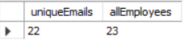
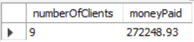

# Rozwiązania zadań rekrutacyjnych JohnnyBros JMDA
## MySQL
### Zad 1
Kwerenda dostępna w pliku [uniqueEmails.sql](uniqueEmails.sql)
- [Zwrócona tabela](csv/uniqueEmails.csv) \

### Zad 2
Kwerenda dostępna w pliku [may2005.sql](may2005.sql)
- [Zwrócona tabela](csv/may2005.csv) \

### Zad 3
Przedstawiłem rozwiązanie jako tabelę dostarczonych zamówień razem z sumą do zapłaty. Kwerenda dostępna w pliku [ordersWithPrice.sql](ordersWithPrice.sql)
- [Zwrócona tabela](csv/ordersWithPrice.csv) 

Próbowałem znaleźć średnią różnice pomiędzy zamówieniem a zapłatą, jednak nie byłem w stanie połączyć tabeli payment z tabelą orders na podstawie daty, tabela payments nie zawiera również "orderNumber", przez co nie mogłem jej połączyć z tabelą orderDetails oraz orders. \
Kwerenda z testem połączenia tabel orders i payment dostępna w pliku [avg_diff_test.sql](avg_diff_test.sql)
- [Zwrócona tabela](csv/avgDiffTest.csv)
