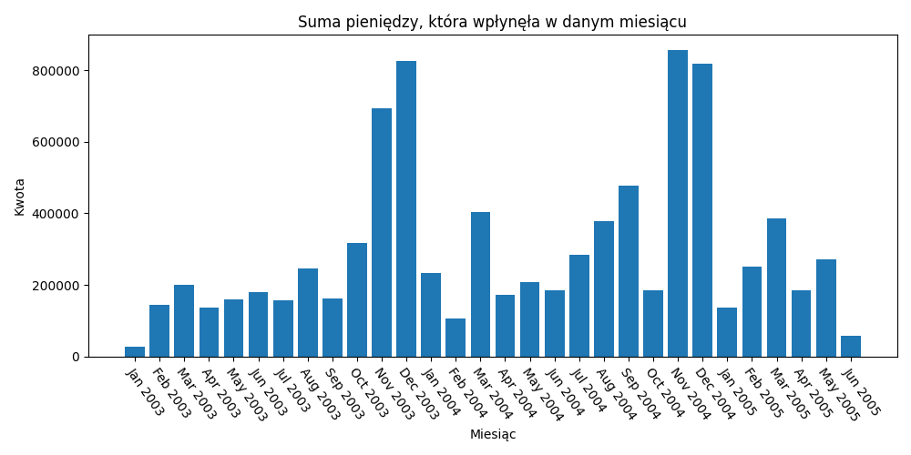
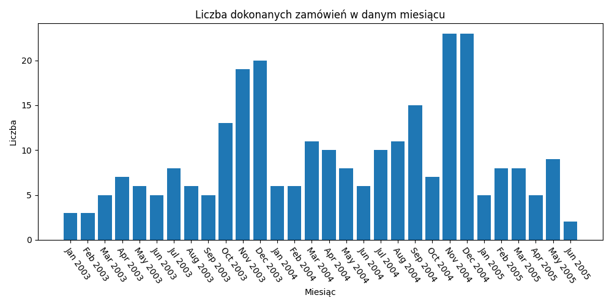
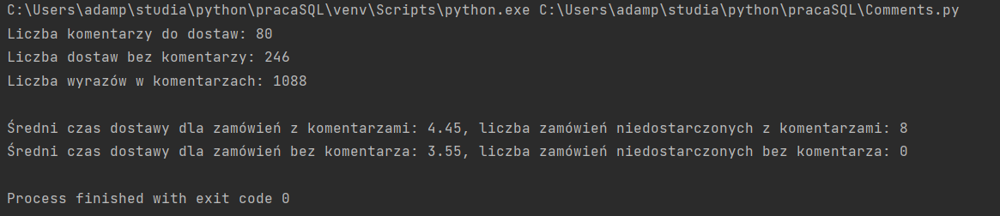

# Rozwiązania zadań rekrutacyjnych JohnnyBros JMDA
## Python
Żeby połączyć się z serwerem MySQL użyłem metody connector z biblioteki mysql. Serwer zainicjalizowałem w kontenerze Docker.\
Obraz można zbudować przy pomocy komendy:
```
docker build -t local-mysql .
```
Po czym wystartować kontener przy pomocy komendy:
```
docker run -d local-mysql
```
### Wykresy płatności w czasie
Kod użyty do stworzenia wykresów dostępny w pliku [Plots.py](Plots.py)
- Suma pieniędzy, która wpłynęła w danym miesiącu

- Liczba dokonanych zamówień w danym miesiącu


### Output do zadań 2 i 3
Kod użyty do uzyskania rozwiązań dostępny w pliku [Comments.py](Comments.py)

